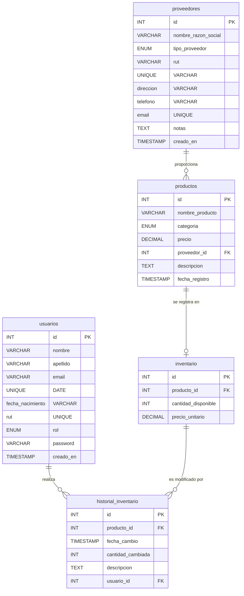

```mermaid
erDiagram
    usuarios {
        INT id PK
        VARCHAR nombre
        VARCHAR apellido
        VARCHAR email UNIQUE
        DATE fecha_nacimiento
        VARCHAR rut UNIQUE
        ENUM rol
        VARCHAR password
        TIMESTAMP creado_en
    }

    proveedores {
        INT id PK
        VARCHAR nombre_razon_social
        ENUM tipo_proveedor
        VARCHAR rut UNIQUE
        VARCHAR direccion
        VARCHAR telefono
        VARCHAR email UNIQUE
        TEXT notas
        TIMESTAMP creado_en
    }

    productos {
        INT id PK
        VARCHAR nombre_producto
        ENUM categoria
        DECIMAL precio
        INT proveedor_id FK
        TEXT descripcion
        TIMESTAMP fecha_registro
    }

    inventario {
        INT id PK
        INT producto_id FK
        INT cantidad_disponible
        DECIMAL precio_unitario
    }

    historial_inventario {
        INT id PK
        INT producto_id FK
        TIMESTAMP fecha_cambio
        INT cantidad_cambiada
        TEXT descripcion
        INT usuario_id FK
    }

    usuarios ||--o{ historial_inventario : "realiza"
    proveedores ||--o{ productos : "proporciona"
    productos ||--o| inventario : "se registra en"
    inventario ||--o{ historial_inventario : "es modificado por"
```